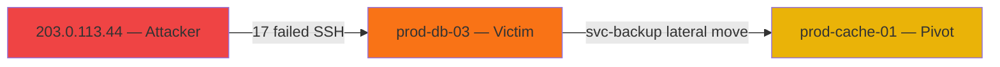

# SOC Triager — Dashboard Design & Specification

> **Audience:** Engineer B (primary builder), Engineer A (consumer/reviewer for analyst UX copy)
> **Scope:** Full UX spec, component inventory, routing map, real-time data contracts, RBAC rendering rules, and performance expectations for the React + Vite SOC dashboard deployed to Vercel.

---

## 1. Overview

The dashboard is the primary human interface for the SOC Triager system. It is a single-page application (SPA) built in **React 18 + TypeScript**, bundled by **Vite**, deployed continuously to **Vercel**. It communicates with the backend via a thin **BFF (Backend-for-Frontend) layer** of Vercel Serverless/Edge Functions, never hitting the FastAPI backend directly from the browser.

The dashboard serves three analyst personas:

| Role | Capabilities |
|---|---|
| **Analyst** | View all alerts and incidents; acknowledge and assign alerts; view all tabs including containment playbooks (read-only) |
| **Senior Analyst** | All Analyst capabilities + escalate incidents + annotate audit trail |
| **Approver** | All Senior Analyst capabilities + approve containment playbooks for ops execution |

RBAC is enforced **twice**: client-side via the `RoleGate` component (UX layer, prevents accidental clicks) and server-side via the BFF and FastAPI (real security enforcement).

---

## 2. App Shell & Navigation

### 2.1 Layout

```
┌──────────────────────────────────────────────────────────┐
│ TOP BAR                                                  │
│  [SOC Triager logo]  [Search]  [WS Pill]  [Role]  [🌙]  │
├──────────┬───────────────────────────────────────────────┤
│ SIDEBAR  │  PAGE CONTENT                                 │
│          │                                               │
│ Alert    │                                               │
│ Queue    │                                               │
│ Incidents│                                               │
│ Navigator│                                               │
│ Ops      │                                               │
│ Playbooks│                                               │
│ Settings │                                               │
│          │                                               │
└──────────┴───────────────────────────────────────────────┘
```

### 2.2 Top Bar Components

- **Logo/wordmark** — left-anchored, links to `/alerts`
- **Global entity search** — full-width input, searches by IP address, hostname, username, or MITRE technique ID (e.g., `T1110`); returns a dropdown of matching incidents/alerts with severity chips
- **LiveConnectionPill** — WebSocket status indicator:
  - 🟢 `Connected` — solid green dot
  - 🟡 `Reconnecting…` — pulsing amber dot + retry count
  - 🔴 `Disconnected` — red dot + `Manual Refresh` button fallback
- **Role badge / switcher** — shows current role, dropdown to switch (dev/demo only; replaced by identity provider in production)
- **Dark/Light toggle** — persisted to `localStorage`

### 2.3 Left Sidebar

Collapsible to icon-only mode (persisted in Zustand store).

| Icon | Label | Route | Role Gate |
|---|---|---|---|
| 🚨 | Alert Queue | `/alerts` | All |
| 📋 | Incidents | `/incidents` | All |
| 🗺️ | MITRE Navigator | `/navigator` | All |
| 📊 | Ops Metrics | `/ops` | All |
| 📚 | Playbook Library | `/playbooks` | All |
| ⚙️ | Settings | `/settings` | All |

### 2.4 Global Toast System

- Rendered via a Zustand-driven toast queue, displayed top-right
- **Critical alert** → red toast, auto-dismissed after 8 s, click navigates to the incident
- **WebSocket reconnection** → amber toast
- **Containment approved** → green toast

---

## 3. Page: Alert Queue (`/alerts`)

### 3.1 Purpose

Primary operational view. Analysts spend 80% of their time here. New alerts stream in via WebSocket; the table updates without a page reload.

### 3.2 Data Source

- **WebSocket** (`/ws/alerts` via BFF proxy) for live incoming rows
- **REST** `GET /api/alerts` (BFF proxy → FastAPI) for the initial page load and after filter changes

### 3.3 Table Columns

| Column | Type | Sortable | Filterable | Notes |
|---|---|---|---|---|
| Severity | `SeverityBadge` | Yes | Multi-select | `critical / high / medium / low / info` |
| Timestamp | ISO datetime | Yes (default desc) | Date-range picker | Formatted as relative time (`2 min ago`) with full ISO tooltip |
| Entity | `string` | No | Free-text search | Host name, username, or source IP — whichever is most salient |
| MITRE Technique | `TechniqueChip` | No | Multi-select (technique IDs) | Shows `T####.###` badge + tactic label |
| Anomaly Score | `SparklineScore` | Yes | Range slider | 0.0–1.0; sparkline shows score history for this entity over last 24 h |
| Status | `StatusPill` | Yes | Multi-select | `New / Ack / Escalated / Closed` |
| Assignee | `string` | No | Select from user list | Empty if unassigned |

### 3.4 Filter Bar

Persistent filter bar above the table (not a modal):

- **Severity** multi-select chips
- **Status** multi-select chips
- **Technique** searchable multi-select (type `T1110` or `brute force`)
- **Date range** picker (Last 1h / 6h / 24h / 7d / custom)
- **Entity** free-text input
- **Clear all** button

Filter state is reflected in the URL query string so links are shareable.

### 3.5 Real-Time Row Insertion

When a new alert arrives via WebSocket:
1. Prepend the row to the top of the current filtered view (if the alert passes current filters)
2. Apply a 1.5 s yellow-highlight fade animation (`bg-yellow-50 → transparent`)
3. Increment the `LiveConnectionPill` new-alert counter badge
4. If `severity === 'critical'`, also fire a global toast

### 3.6 Bulk Action Bar

Appears when ≥1 row is checkbox-selected:

- **Acknowledge selected** → `POST /api/alerts/bulk-ack`
- **Assign to me** → `POST /api/alerts/bulk-assign`
- Row count badge (e.g., `3 selected`)

### 3.7 Row Click Behavior

Opens the **Incident Detail drawer** (slides in from the right, 640 px wide). The drawer preserves the table scroll position. Deep-link URL changes to `/incidents/:id` so the browser Back button closes the drawer.

---

## 4. Page: Incident Detail (`/incidents/:id`)

### 4.1 Header

```
[Incident Title — auto-generated, e.g. "Brute-Force Credential Access — prod-db-03"]
[Severity badge]  [Status dropdown ▾]  [Assignee]  [Created at]  [Updated at]
```

The **status dropdown** is role-gated:

| Action | Analyst | Senior Analyst | Approver |
|---|---|---|---|
| Acknowledge | ✅ | ✅ | ✅ |
| Escalate | ❌ (disabled, tooltip) | ✅ | ✅ |
| Close | ❌ | ✅ | ✅ |

### 4.2 Tab: Overview

Renders the LLM-generated **Markdown incident report** via `react-markdown` + `remark-gfm`:

- Timeline of events (auto-formatted table from JSON)
- Entities involved (host, user, IPs) with hyperlinks to filtered Alert Queue
- Evidence excerpts (up to 5 representative raw log lines, code-block formatted)
- Recommended immediate action (from LLM output)

### 4.3 Tab: Attack Graph

Renders the Mermaid-syntax attack graph via the `mermaid` npm package:



Node color coding:
- 🔴 Red — confirmed attacker IP
- 🟠 Orange — victim host
- 🟡 Yellow — pivot/lateral movement target
- 🔵 Blue — benign co-located host (context)

Controls: zoom in/out, pan, reset view, download as PNG.

### 4.4 Tab: MITRE Technique

Card layout:

```
[T1110.001]                           [Confidence: 87%]
Brute Force: Password Guessing
Tactic: Credential Access

[Official ATT&CK description — loaded from the pinned STIX bundle via /api/mitre/technique/T1110.001]

LLM Rationale:
"17 failed SSH authentication attempts from 203.0.113.44 against 4 distinct service accounts
within 90 seconds, consistent with automated password guessing rather than user error."

[Link → MITRE ATT&CK official page]  [View in Navigator →]
```

### 4.5 Tab: Containment Playbook

```
┌─────────────────────────────────────────────────────────────┐
│  Generated Containment Playbook                [Download]   │
│  Technique: T1110.001 · Generated: 2026-08-10T09:14:22Z     │
│  ⚠️  DRAFT ONLY — requires Approver authorization            │
├─────────────────────────────────────────────────────────────┤
│  [Syntax-highlighted Ansible YAML / firewall rule snippet]   │
│                                                              │
│  - name: Block attacker IP                                   │
│    hosts: edge-firewalls                                     │
│    tasks:                                                    │
│      - iptables:                                             │
│          chain: INPUT                                        │
│          source: 203.0.113.44                                │
│          jump: DROP                                          │
│                                                              │
│  [Approve for Ops ←— disabled (Analyst role)]                │
│   Tooltip: "Only Approvers can authorize containment runs"   │
└─────────────────────────────────────────────────────────────┘
```

- **Download** — always available; triggers `GET /api/incidents/:id/playbook` → blob download
- **Approve for Ops** — `RoleGate` wraps this button:
  - Analyst/Senior Analyst: rendered as disabled with tooltip
  - Approver: enabled; `POST /api/incidents/:id/approve`; success state shows green confirmation + ledger entry
- API also enforces this: non-Approver JWT receives `403` on the approve endpoint regardless of UI state

### 4.6 Tab: Audit Trail

Append-only ledger visualization:

```
Entry #7  [Hash: a3f9d2...] [Prev: 8bc014...]  2026-08-10T09:20:11Z
  Action: PLAYBOOK_APPROVED  Actor: approver@example.com

Entry #6  [Hash: 8bc014...] [Prev: 22ef9a...]  2026-08-10T09:18:44Z
  Action: STATUS_ESCALATED   Actor: senior@example.com

Entry #5  [Hash: 22ef9a...] [Prev: 4d71bb...]  2026-08-10T09:16:30Z
  Action: INCIDENT_CREATED   Actor: system
```

Each entry shows: sequential ID, its own SHA-256 hash, previous-hash link (clickable tooltip shows the hash chain is intact), timestamp, action type, actor.

---

## 5. Page: MITRE Navigator (`/navigator`)

- Embeds the official **MITRE ATT&CK Navigator** web component (loaded from npm: `@mitre-attack/attack-flow-builder` or the Navigator's published JS)
- Auto-loads a generated `layer.json` heatmap fetched from `GET /api/navigator/layer.json` via BFF
- Layer colors techniques by frequency: grey → yellow → orange → red (0 to max occurrences this week)
- **Sidebar panel** (right of Navigator): "Top Techniques This Week" list — technique ID + name + count, each row links to `/alerts?technique=T####`

---

## 6. Page: Ops Metrics (`/ops`)

All panels use **Recharts** components, data fetched from `GET /api/metrics` (BFF proxy → Prometheus summary):

| Panel | Chart Type | Data |
|---|---|---|
| Event Throughput | LineChart (events/sec, 1-min resolution, last 1 h) | Prometheus `events_ingested_total` |
| Alert Volume Trend | AreaChart (alerts/hr, last 7 d) | Prometheus `alerts_generated_total` |
| Anomaly Score Distribution | HistogramChart (bins 0.0–1.0) | Prometheus `anomaly_score_histogram` |
| LLM Cost | BarChart ($ per 1,000 flagged events, daily, last 7 d) | Backend token-cost log |
| Pipeline Latency | LineChart (p50 ms, p95 ms, last 1 h) | Prometheus `pipeline_latency_seconds` |

Each panel has a `MetricCard` wrapper with: title, current value badge, trend arrow (up/down vs previous period), and a `?` info tooltip explaining the metric.

---

## 7. Page: Playbook Library (`/playbooks`)

Read-only catalog of containment templates registered in the system:

| Template | Technique Category | IOC Variables | Actions |
|---|---|---|---|
| Brute Force — IP Block | T1110.x | `source_ip` | Edge firewall DROP + account lockout |
| Lateral Movement — Segmentation | T1021.x | `pivot_host`, `target_subnet` | ACL isolation |
| DDoS Mitigation | T1498.x | `source_cidrs[]` | Rate limiting + upstream null route |
| Privilege Escalation — Account Suspend | T1548.x | `user_id`, `host` | Account disable + session termination |
| Data Exfiltration — Egress Block | T1041.x | `destination_ip`, `port` | Firewall egress DROP |

Clicking a template row opens a detail drawer showing the full Jinja2 template source with syntax highlighting.

---

## 8. Component Inventory

### 8.1 Shared Components

| Component | Props | Notes |
|---|---|---|
| `SeverityBadge` | `level: 'critical'|'high'|'medium'|'low'|'info'` | Color-coded pill; accessible with ARIA label |
| `TechniqueChip` | `id: string`, `name: string`, `tactic: string` | Compact badge; tooltip shows full tactic |
| `LiveConnectionPill` | `status: 'connected'|'reconnecting'|'disconnected'`, `newAlerts: number` | Top bar WS status |
| `AttackGraph` | `mermaidSource: string` | Wraps the mermaid render; handles zoom/pan |
| `MarkdownReport` | `markdown: string` | `react-markdown` + `remark-gfm` + code highlighting |
| `LedgerEntry` | `entry: IncidentLedgerEntry` | Hash + prev-hash display with chain-validity indicator |
| `RoleGate` | `requiredRole: Role`, `children: ReactNode` | Renders children; disabled+tooltip if role insufficient |
| `MetricCard` | `title`, `value`, `trend`, `children (chart)` | Ops panel wrapper |
| `AlertTable` | `alerts: Alert[]`, `onRowClick`, `filters` | Full TanStack Table instance |
| `SparklineScore` | `scores: number[]`, `current: number` | Micro line chart; 24 h entity score history |
| `StatusPill` | `status: AlertStatus` | `New / Ack / Escalated / Closed` with colors |

### 8.2 Hooks

| Hook | Purpose |
|---|---|
| `useAlertsFeed` | Manages the WebSocket connection; pushes new alerts into Zustand store |
| `useAuth` | Reads/writes JWT + role from memory; provides `logout()`, `hasRole()` |
| `useIncidents` | TanStack Query wrapper for `GET /api/incidents` with caching/pagination |
| `useIncidentDetail` | TanStack Query for a single incident + all sub-resources |
| `useMitreLayer` | Fetches `layer.json` for the Navigator page |
| `useMetrics` | Fetches and transforms `/api/metrics` for Recharts |

---

## 9. State Management

**Zustand stores:**

- `alertStore` — live alert list, WebSocket status, new-alert counter
- `authStore` — JWT, role, user identity
- `uiStore` — sidebar collapsed state, dark mode, toast queue

**TanStack Query** handles all server state (fetch, cache, revalidate, loading/error states) for REST endpoints. Zustand handles purely client-side and real-time WebSocket state.

---

## 10. Performance Targets

| Metric | Target |
|---|---|
| Lighthouse Performance (Vercel Production) | ≥ 85 |
| Largest Contentful Paint | < 2.5 s on a 4G connection |
| Alert Queue initial load (200 rows) | < 1 s |
| WebSocket message → row visible in table | < 200 ms |
| Mermaid attack graph render | < 1 s for graphs ≤ 50 nodes |
| Bundle size (gzipped JS) | < 400 KB |

---

## 11. Accessibility & UX Standards

- All interactive elements have ARIA labels
- Keyboard navigable: Tab/Shift-Tab through table rows; Enter to open detail drawer
- Color is never the sole differentiator — severity levels also use text labels and icons
- Error states always show a user-actionable message (never just `Error 500`)
- Loading states use skeleton screens, not spinners alone
- Dark mode applies to every component including Mermaid graphs (CSS variable injection)
